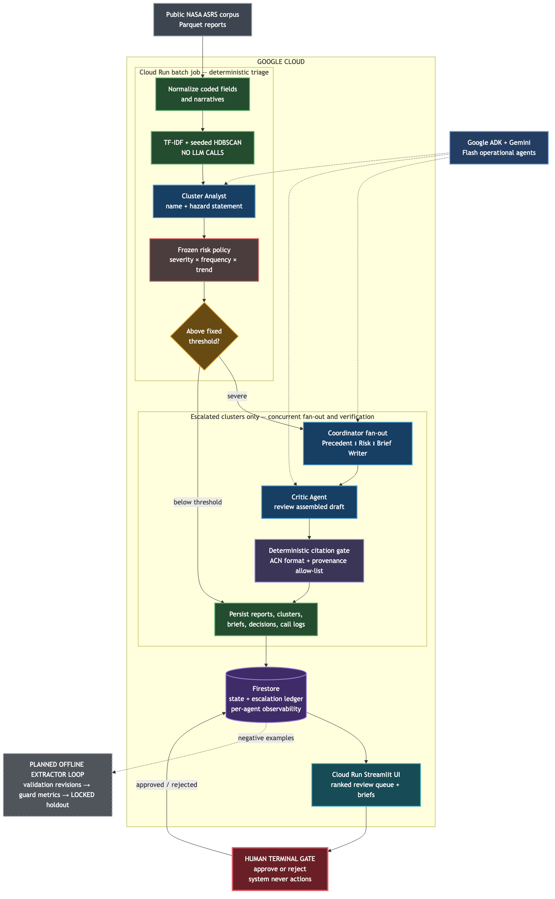
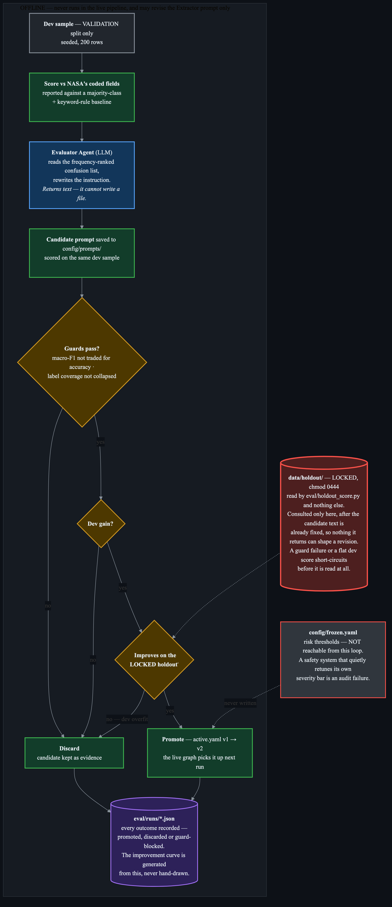

# VIGIL

VIGIL turns a batch of public NASA ASRS safety reports into a ranked list of
emerging hazards and source-cited investigator drafts. It drafts and recommends;
a human is the only terminal approval gate.

**Live:** https://vigil-ui-715230861973.us-central1.run.app — deployed on Cloud
Run, with the batch pipeline running as a Cloud Run job that persists reports,
clusters, escalations, and a per-agent call log (model, tokens, latency) to
Firestore.

**Demo video:** [VIGIL — All Things Agentic Hackathon](https://youtu.be/kGiqvn-vrv0)
(3:50).

## The problem

NASA's Aviation Safety Reporting System takes in over 100,000 confidential
incident reports a year, every one read by expert human analysts. The value is
not in any single report — it is in noticing that eleven separately-filed
reports over five weeks describe the same emerging hazard, a fact that exists
only in the aggregate. VIGIL compresses "40 similar reports filed separately"
into "one named hazard with a source-cited draft brief," running unattended on
a weekly Cloud Scheduler trigger, with a human as the only terminal gate.

## The architecture in one picture



*Also available as an **[interactive diagram](https://vigil-architecture.vercel.app/diagram.html?theme=light)** — the same live path,
pannable and searchable, with per-node detail and route tracing between stages.
The PNG above stays the canonical figure; the hosted version is for reading the
graph closely.*

Reading the diagram: everything green is deterministic code, everything blue is a
model call. The two are deliberately not interchangeable. Clustering and risk
scoring contain **no** model call, the Analyst names hazards but never computes
risk, and the last thing to touch any brief is deterministic code rather than an
agent. The headline feature is what the agents are structurally forbidden from
doing — the full invariant list, each enforced by a test, is in
[Architecture and safety invariants](#architecture-and-safety-invariants).

## What is runnable now

### No credentials required

```bash
uv sync --all-groups
make demo     # end-to-end pipeline on a bundled six-report fixture
make ui       # Streamlit review UI
make check    # ruff + pytest
```

`make ui` serves `artifacts/demo_run.json` when present — a committed snapshot of
a real live run over real ASRS data (23 hazard clusters, 4 escalated, 1,328
severe singletons, 5,000 reports triaged), so the UI shows genuine model-written
briefs without any credentials. It falls back to the bundled fixture if that
file is absent.

### With real data

```bash
make download   # HF Parquet export; locks data/holdout/test.parquet read-only
make run-real     # 5,000-report seeded slice, deterministic stages only
make eval-offline # clustering vs Events_Anomaly + Critic catch rate (no model calls)
```

`make download` fetches only the Hugging Face Parquet export and makes the test
split a one-time, read-only `data/holdout/test.parquet` copy. Only
`eval/holdout_score.py` may read that path, and it is excluded from every
container image.

### With live Gemini agents

Put a Google AI Studio key in `.env` (gitignored) as `GOOGLE_API_KEY=...`, then:

```bash
set -a; source .env; set +a
make run-live   # adds a live Analyst call per cluster, plus the parallel
                # Coordinator (Precedent ∥ Risk ∥ Brief Writer) and Critic
                # for every escalated cluster
make artifact   # same run, saved to artifacts/demo_run.json for the UI
```

Deterministic stages stay deterministic in live mode: clustering and risk scoring
are byte-identical with and without `--live`. Only naming, prose, and brief
drafting come from the model.

### Self-improvement loop (offline, extractor only)

```bash
make improve    # dev sample -> Evaluator -> guards -> locked holdout -> promote/discard
```

This never runs inside the live pipeline. It scores the Extractor against NASA's
own coded fields on a seeded slice of the **validation** split, asks an Evaluator
agent to rewrite the extractor instruction from the resulting confusion list, and
promotes the revision only if it clears the reward-hacking guards *and* improves
on the locked holdout. Every outcome — promoted, discarded, or guard-blocked — is
written to `eval/runs/*.json`, which is committed.

## Measured results

All numbers come from `eval/runs/`, which is committed, not from a spreadsheet.

### Extractor self-improvement

First live run, 2026-08-29, seeded 200-row dev sample and 100-row locked holdout:

| Extractor prompt | dev macro-F1 | dev accuracy | holdout macro-F1 | holdout accuracy |
|---|---|---|---|---|
| majority-class + keyword baseline | 0.0515 | 0.395 | — | — |
| `v1` (hand-written) | 0.0056 | 0.105 | 0.0081 | 0.080 |
| `v2` (promoted by the loop) | **0.4099** | **0.600** | **0.4219** | **0.680** |

Three things we are reporting because they are true, not because they flatter:

1. **The hand-written v1 extractor lost to a trivial baseline.** Majority-class
   plus keyword rules beat the live LLM by roughly 9x on macro-F1. v1 never told
   the model that the ASRS labels are a *closed vocabulary*, so it answered
   "Approach" where the coded value is "Initial Approach". This is why the
   baseline is in the harness at all: without it, v2's 0.41 would read as a win
   from nothing rather than the repair of a regression.
2. **The holdout gain exceeded the dev gain** (+0.4139 vs +0.4043) — the opposite
   of overfitting, and the real evidence that the Evaluator fixed a defect rather
   than memorized the dev split.
3. **The field the loop did not optimize still trails its baseline.**
   `flight_phase` improved 0.084 → 0.121 on dev, while the keyword baseline
   scores 0.171. The loop optimizes `primary_problem`; the untargeted field is
   still beaten by a deterministic heuristic.

### Clustering and the citation gate (`make eval-offline`)

Deterministic, no model calls, seeded — anyone with the dataset regenerates
these. Real 5,000-report slice:

| Metric | Value | Reference |
|---|---|---|
| Critic catch rate (uncited + fabricated claims) | **1.000** | 400 seeded claims, 200 trials |
| Critic retention of correctly cited claims | **1.000** | control — a gate that deletes everything would score 1.000 on catch rate alone |
| Cluster purity vs `Events_Anomaly` | 0.301 | majority-class baseline 0.219 |
| Adjusted Rand vs `Events_Anomaly` | 0.0018 | — |
| Noise fraction | 0.837 | **exceeds our own declared guard of 0.40** |

**The clustering numbers are bad and we are leaving them visible.** Purity beats
a single-blob baseline by only +0.08, the Adjusted Rand is effectively zero, and
84% of reports end up unclustered — more than double the `noise_fraction < 0.40`
tripwire this project predeclared in `docs/EVAL.md`. That guard exists in
`eval/guards.py` but was only ever invoked on the extractor promotion loop, so
nothing had checked it against the clustering stage it was written for until we
ran this.

In fairness to the design, `Events_Anomaly` is a coarse 58-value administrative
taxonomy whose largest bucket ("ATC Issue All Types", 1,097 reports) spans
operationally unrelated events, so a cluster can be operationally coherent while
scoring badly against it — and the 23 clusters it does produce are recognisably
real hazards (drone encounters at low altitude, cabin fume events, NMAC
conflicts). But an ARI of 0.0018 is too low to wave away.

We did not tune the clustering parameters to get under the guard. Doing that
hours before a deadline, with no held-out check on the clustering stage, is the
exact reward-hacking behaviour the rest of this system is built to prevent. It is
recorded as a measured failure in [`docs/PHASES.md`](docs/PHASES.md) instead.

## Failure tolerance

The Coordinator's three sub-agents run concurrently with independent failure
isolation. You can watch that work instead of taking our word for it:

```bash
set -a; source .env; set +a        # --live needs GOOGLE_API_KEY
uv run python -m pipeline.run_batch --demo --live --fail-agent risk
```

One dead sub-agent yields a `DEGRADED` brief whose lost section falls back to a
cited deterministic line; two dead sub-agents fall back to the fully
deterministic template rather than dropping the cluster. The `DEGRADED` banner is
re-asserted by the orchestrator after the citation gate, so a Critic that forgets
to echo it cannot make a partial-failure brief look clean.

## Architecture and safety invariants

The main pipeline diagram and its reading key are at the
[top of this file](#the-architecture-in-one-picture), and the same live path is
browsable as an [interactive diagram](https://vigil-architecture.vercel.app/diagram.html?theme=light). The offline
self-improvement loop is a separate system that never runs in the
live pipeline:




`pipeline/cluster.py` has no generative model calls: it clusters embeddings with
HDBSCAN only, in a reproducible single-worker configuration. The risk policy in
`config/frozen.yaml` is loaded as immutable data at runtime; agents cannot retune
the escalation threshold. The deterministic citation gate in `agents/critic.py`
removes every factual claim missing a bracketed ACN citation — validating
*provenance*, not just citation shape: an ACN that appears in no source report is
stripped even though it is correctly formatted.

The self-improvement loop is fenced in code, not just in prose. It may revise the
Extractor instruction and nothing else (`REVISABLE == {"extractor"}`; any other
agent raises). A promotion writes `config/prompts/`, never `config/frozen.yaml`.
`eval/holdout_score.py` is the only module that may read `data/holdout/`, and it
is called only at the promote/discard decision, after the candidate text is
already fixed — so nothing the holdout returns can influence a revision. Each of
those is enforced by a test in `tests/`.

The live ADK graph is defined in `agents/definitions.py`, using the verified Flash
model ID `gemini-3.7-flash`; batch embedding uses `gemini-embedding-2`. Both IDs
were verified in Google AI model documentation on 2026-08-21. No credentials are
included or required for the local demo.

**Current build status, phase by phase:** [`docs/PHASES.md`](docs/PHASES.md) — read this first if you're picking the project up mid-stream.

For detailed design, evaluation, delivery plan, and recording plan, see
[the project docs](docs/ARCHITECTURE.md).

## Cloud deployment

```bash
gcloud auth login
gcloud config set project your-project
gcloud services enable run.googleapis.com cloudbuild.googleapis.com \
    artifactregistry.googleapis.com secretmanager.googleapis.com

set -a; source .env; set +a
export GOOGLE_CLOUD_PROJECT=your-project
make deploy
```

This deploys two separate Cloud Run surfaces, each with its own least-privilege
service account rather than the default compute identity:

- **`vigil-ui`** (public, `--allow-unauthenticated`) — holds **`roles/datastore.user`
  and nothing else**. It serves the committed `artifacts/demo_run.json` snapshot
  and writes the human analyst's approve/reject decisions to Firestore, so a
  decision survives the Cloud Run instance that took it. It holds **no
  `secretAccessor`**, so the public surface cannot reach the Gemini key and
  cannot make a model call — every model call happens in the batch job below.
- **`vigil-batch`** (Cloud Run job) — holds `secretmanager.secretAccessor` on a
  dedicated `gemini-api-key` secret (created by `deploy.sh`, never passed as a
  plain env var) and `roles/datastore.user`. Runs the full pipeline with
  `--live --firestore`, exercising all three mandatory stack components in one
  execution.

`.gcloudignore` and `.dockerignore` both exclude `.env`, `.venv`, `data/raw`, and
`data/holdout` — the locked holdout must never reach a container image. See
[`infra/README.md`](infra/README.md) for why the Dockerfile lives at the repo
root instead of `infra/`.

## Data credit

VIGIL uses the public NASA Aviation Safety Reporting System corpus as packaged
by Hugging Face dataset `elihoole/asrs-aviation-reports` (Apache-2.0 packaging).
The historical data is demonstrated as a replay, never represented as a live feed.
